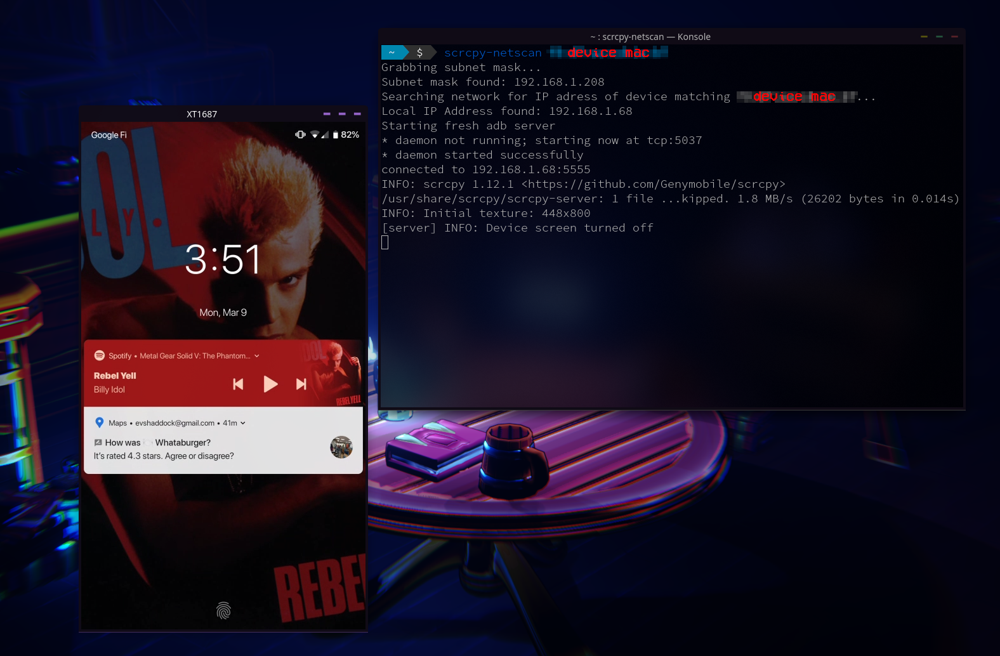

# SCRCPY-NETSCAN

Used with [scrcpy](https://github.com/Genymobile/scrcpy) to automatically connect to your android device wirelessly without knowing the current local IP of the device. Allows for a quick one button solution to connecting to your phone

It scans your network for the IP address of a mac address you provide it, and then feeds that IP into adb to connect to your phone. please make sure you follow the instructions on the [scrcpy repo](https://github.com/Genymobile/scrcpy) for wirelessly connecting at least once before using this tool

Usage: 

`./scrcpy-netscan <target mac address>`

Requirements

**net-tools, sed, nmap, grep, scrcpy + its deps**